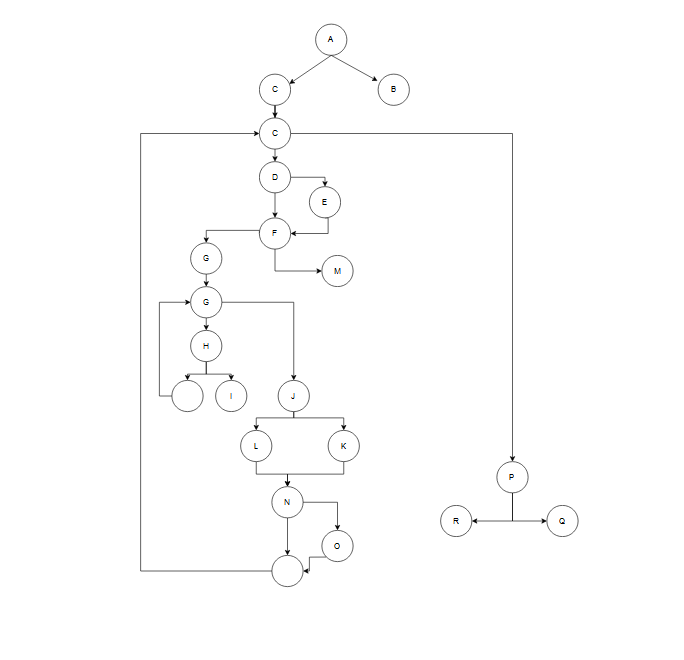

Damir Bacevac 223026

2. SLikata za CFG e dodadena.

3. Na crtezot dokolku gi izdvojam jazlite za for ciklus (gi dodavav za polesno vizuelno predstavuvanje na ciklusite a toa se 4) imam 18 jazli i 26 rebra sto znaci deka spored formulata 26-18+2 = 10. Ciklomatskata kompleksnost iznesuva 10.

4. Every Branch kriteriumot, bara da gi ispitame site mozni granki na izvrsuvanje na kodot. Za taa cel, treba da kreirame test primeri koi kje gi pokrivaat site uslovi i granki vo porgramata, za osiguruvanje na kvalitetot na porgramata.
Test slucaj koga listata allItems e null:
List<Item> allItems = null;
int payment = 100;
Ovoj test slucaj kje go pokrie uslovot na grankata A i kje proveri dali prgramata kje frli RuntimeException.

Test slucaj koga listata allItems e prazna:
List<Item> allItems = new ArrayList<>();
Ovoj test slucaj go pokriva delot od kodot koga ima ciklus i se pominuva/proeveruva sekoj element vo allItems (granka C).

Test slucaj koga se podeseni site vlezni argumenti za objektot Item vo listata allItems:
List<Item> allItems = new ArrayList<>();
allItems.add(new Item("Item1", "123456789", 100, 0.1f));
Ovoj test slucaj kje go pomine delot od kodot koj go vcituva objektot Item (granki D i F).

Test slucaj koga name e null ili prazen strign:
allItems.add(new Item(null, "123456789", 100, 0.1f));
Ovoj test slucajgo pokriva delot za postavuvanje na imeto na predmetot/stavkata (granki D i E).

Test slucaj koga barcode e null:
List<Item> allItems = new ArrayList<>();
allItems.add(new Item("Item1", null, 100, 0.1f));
int payment = 100;
Ovoj test slucaj go testira delot koga frla RuntimeException poradi nedostasuvanje na barkod (granki F i M).

Test slucaj koga barcode ime nevaliden karakter:
allItems.add(new Item("Item1", "12345a789", 100, 0.1f));
Ovoj test slucaj ќе го помине делот од кодот кога фрла RuntimeException поради невалиден карактер во баркодот (гранка G и I).

Test slucaj koga price e pogolemo od 300, ima popust i pocetokot na barcode e '0':
allItems.add(new Item("Item1", "0123456789", 400, 0.1f));
Ovoj test slucaj kje go pomine delot vo koj sumata se namaluva za 30 (granki N i O).

Test slucaj koga sumata e pomala ili ednakva na plakjanjeto:
allItems.add(new Item("Item1", "123456789", 50, 0.1f));
allItems.add(new Item("Item2", "123456789", 40, 0.2f));
int payment = 100;
Ovoj test slucaj go pokriva zavrsniot uslov i del od kodot koga vrakja true (granki P i Q).

Test slucaj koga sumata e pogolema od plakjanjeto:
allItems.add(new Item("Item1", "123456789", 100, 0.1f));
allItems.add(new Item("Item2", "123456789", 200, 0.2f));
int payment = 20;
Ovoj test slucaj go testira if-else delot na krajot od kodot kade vrakja false (granki P i R).

5. Spored Multiple Condition kriteriumot, treba da gi razgledame site mozni kombinacii na vistinitost i na laznost na poedinecnite uslovi na slozeniot uslov.
Trite poedinecni uslovi se:
item.getPrice() > 300
item.getDiscount() > 0
item.getBarcode().charAt(0) == '0'
1.allItems.add(new Item("Item1", "0123456789", 400, 0.1f)) - T T T - Site tri uslovi se tocni, testot e uspesen.
2.allItems.add(new Item("Item1", "1123456789", 400, 0.1f)) - T T F - Posledniot uslov ne e tocen i nema da imame popust od 30 poradi nemanje 0 vo barkodot.
3.allItems.add(new Item("Item1", "0123456789", 400, 0.0f)) - T F T - Vtoriot uslov ne e ispolnet bidejki popustot e 0.
4.allItems.add(new Item("Item1", "1123456789", 400, 0.0f)) - T F F - Vtoriot i tretiot uslov se neispolneti poradi barkodot i nemanjeto popust.
5.allItems.add(new Item("Item1", "0123456789", 200, 0.1f)) - F T T - Prviot uslov e neispolnet, cenata e pomala od 300.
6.allItems.add(new Item("Item1", "1123456789", 200, 0.1f)) - F T F - Prviot uslov, cenata ne e pogolema od 300 i tretiot barkodot ne pocnuva so 0.
7.allItems.add(new Item("Item1", "0123456789", 200, 0.0f)) - F F T - Prvite dva uslovi ne se tocni, cenata i popustot ne se zadovolitelni.
8.allItems.add(new Item("Item1", "1123456789", 200, 0.0f)) - F F F - Niedenen uslov ne e ipolnet, odnosno cenata ne e pogolema od 300, nema popust i nema 0 vo barkodot.